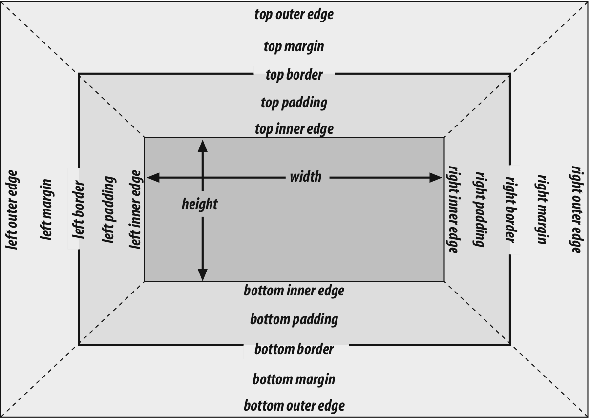
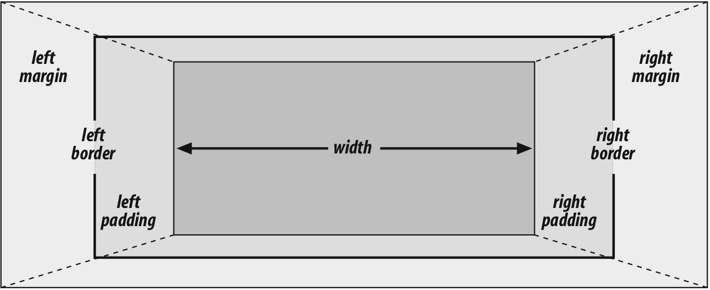
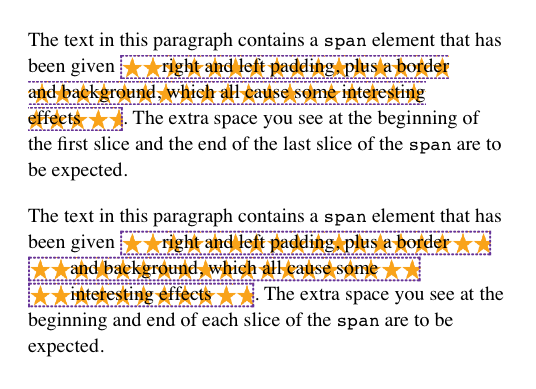

# 基本视觉格式化

## 基本盒模型

1. 所有元素都生成一个或多个矩形盒 element boxes
2. `background` 默认在 `padding-area`
3. border color 默认取前景色 text color
4. 普通流，从左向右、从上向下，非西语流的方向可能会不同
5. `inline-block` box 表现类似替换元素
6. containing block，每个元素盒有个包含块，layout context，通常是父元素盒
7. html 元素是 initial containing block，It's unique in that the viewport—
the browser window in screen media, or the printable area of the page in print media—determines its dimensions, not the size of the content of the root element.

## 改变元素显示

1. `display`: `block` `inline` 等修改的是元素的 display role，而非把元素变成块级或行内元素
2. `box-sizing` 属性可用于所有接受宽度或高度值的元素
3. 七个属性值（`margin-left border-left padding-left width padding-right border-right margin-right`）相加等于包含块的宽度，通常（都是块级时，不设置 `box-sizing`）是父元素的`width`，只有 `width` 和 `margin` 可以设置为 `auto`，其他属性需要设置为特定值或 `0`，只有 `margin` 可为负值
4. 违反上条时，将把 `margin-right` 强制设置为 `auto`， overconstrained
5. 使用百分比单位时，相对于包含块的宽度，`border` 无法使用百分比单位
6. 块级替换元素规则与上述规则相同（img）
7. 垂直方向七个属性值（类似宽度）相加等于包含块的高度，与宽度不同的是：
8. 普通流中，如果 `margin-top` 或 `margin-bottom` 设置为 `auto`，将会自动设置为 `0`
9. 使用百分比高度时，`height` 相对于包含块高度，但当包含块高度为 `auto` 时，`height` 被重置为 `auto`
10. 百分比的 `margin-top` `margin-bottom` `padding-top` `padding-bottom` 都相对于包含块**宽度**
11. 普通流块盒使用 `height: auto` 时，正好高到包含它所有的 inline 内容的 line boxes；有唯一块级子元素时，默认高度从子元素 outer border 顶部到 bottom border 底部，不包含 margin；但当块有 top 或 bottom padding 或border时 ，高度将从outer-top margin 顶部到 outer-bottom margin 底部
12. 垂直方向的 margin 折叠，存在负值时，与正值相加
13. `list-item` 的 marker 不是 list item 的 content-area 的一部分

## 行内元素

1. 行内元素的 content area，每个字符的 em boxes 拼在一起；替换元素的是元素自然高度加上margins borders 或 padding [参考](https://iamvdo.me/en/blog/css-font-metrics-line-height-and-vertical-align
)
2. Inline box 是 content area 加上下两个 half-leading，高度等于 `line-height`；替换元素的 inline box 高度等于 content area，因为没有 leading
3. line box 把该行最高和最低 inline boxes 包裹起来的最矮的box，参见第六章文本属性
4. content area 类似于块盒的 content box
5. inline 元素的背景应用于 content area 加上 padding （padding-area）
6. Any border on an inline element surrounds the content area plus any padding and border.
7. padding borders margins 在非替换元素上不会对 inline 元素或它的盒产生垂直效果，不影响元素行内盒的高度（以及 line box 的高度）
8. 替换元素的 margins 和 borders 影响行内盒高度，和 line box 高度
9.  决定行内的每个元素的行内盒高度的步骤：
    1. 找出不是 inline 元素后代的 inline 非替换元素和文本的 font-size 和 line-height 值，combine them；line-height 减去 font-size 算出 leading
    2. 找出每个替换元素的 height，margin，border，padding 的值加在一起
    3. 对每个 content area，找出它高出整行的 baseline 多少以及低于 baseline 多少；这需要知道每个元素、匿名文本和行本身的 baseline，line them all up；替换元素的底边在整行 baseline 上
    4. 根据元素的 vertical-align 值决定垂直偏移量，元素的inline box会移动多远，修改它高于或低于baseline多少
    5. 计算最终的 line box height，highest inline box top 与 baseline的距离 + lowest inline box bottom 与 baseline 的距离
10. 行高是由组成它的元素和文本等其他内容决定的，`line-height` 属性只影响行内元素和其他行内内容，而非块级元素；只有当块级元素内包含行内内容的时候，`line-height` 会作用于行内内容
11. 12px 24px 文本， line-height 设置为12px，文本默认 all baseline-aligned

12. `vertical-align` 属性值：结合上一章
    1. `top`，元素 inline box top 与 containing line box top 对齐
    2. `bottom`，元素 inline box bottom 与 containing line box bottom 对齐
    3. `text-top`，元素 inline box top 与 parent 的 content area top 对齐
    4. `text-bottom`，元素 inline box bottom 与 parent 的 content area bottom 对齐
    5. `middle`，元素 inline box 垂直中点与 parent 的 baseline 上方 0.5ex 处对齐
    6. `super`，元素 content area 和 inline boex 上移，距离由用户代理确定
    7. `sub`，与 super 同，下移
    8. 百分比，元素上移或下移距离，百分比相对于元素的 line-height
13. `line-height` 对行高的影响（文本元素添加border等的效果）
14. 使用 `line-height` 最好方式是使用数值，为所有元素设置一样的 scale factor；字体的baseline 位置由字体本身决定，大部分字体的字符小于 em 块，一些 cursive 字体例外，会大于 em 块
15. inline 元素的 border 是由 `font-size` 而非 line-height 控制，surround the content area
16. 添加 `padding` 可以使 `border` 远离 text 本身；`padding` 和 `border` 都不影响 line box 的创建和布局
17. CSS2.1规范 “This will cause the borders on subsequent lines to paint over the borders and text of previous lines.” 同样适用于 `background`，设置`padding` 会使 `background` 区域扩展，覆盖上一行
18. `box-decoration-break`: `slice | clone`，inline 元素被分割成多行时的分隔方式，切割还是克隆，包括 background、padding、border 等：

19. 象形文字的字体实际 render 与 em box 行为
20. 替换元素具有固有的宽高，元素的 box properties：content、margins、borders、padding 用来定义 inline box，都可以生效，底部 margin 的 outline edge 与 baseline 对齐
21. 替换元素 `line-height` 不会生效，但依然具备 `line-height` 值，计算 `vertical-align` 属性值时使用，以及替换元素的后代元素
22. 块级元素中的图片，对齐baseline，导致底部可能有几 px 空白，table cell、div 等，可定义 img display block 变为块级或者设置容器 line-height 1px
23. An inline-block element relates to other elements and content as an inline box. In other words, it’s laid out in a line of text just as an image would be, and in fact, inline-block elements are formatted within a line as a replaced element.
24. inline-box width 未定义或为 `auto`，element box shrink to fit content
25. CSS is moving to a system where there are two kinds of display: **the outer display type and the inner display type**. Value keywords like `block` and `inline` represent the outer display type, which provides how the display box interacts with its surroundings. The inner display, in this case flow, describes what should happen inside the element.

| Old Values | New Values |
---|------------
block | block flow 
inline | inline flow
inline-block | inline flow-root
list-item | list-item block flow

As of late 2017, flow and flow-root were supported by Firefox and Chrome, but no other browsers.

26. 其他 display 属性值
27. The computed value of `display` can change if an element is floated or positioned. It can also change when declared for the root element. In fact, the values `display`, `position`, and `float` interact in interesting ways.

